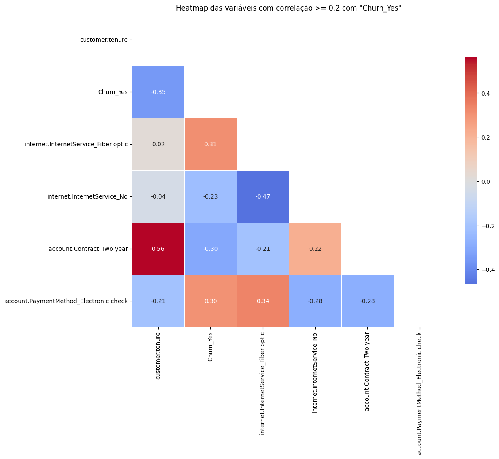
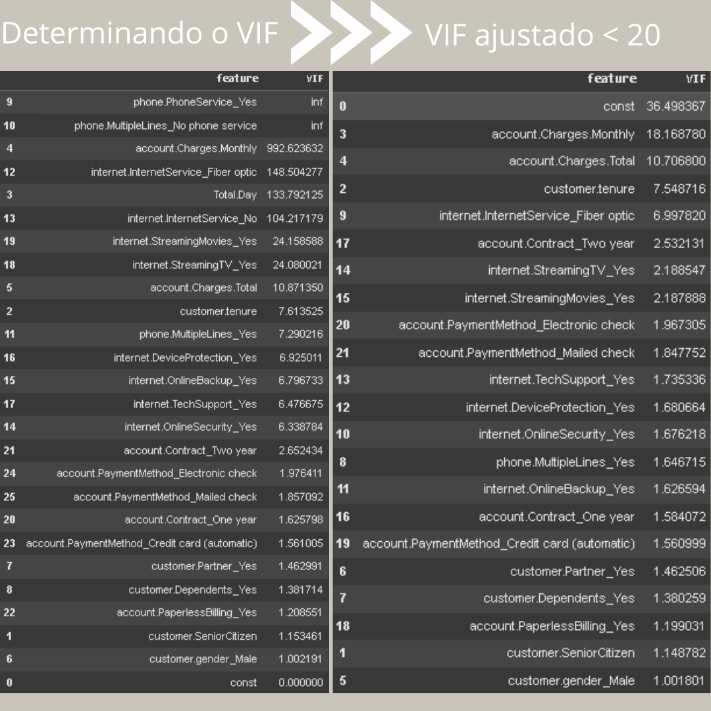
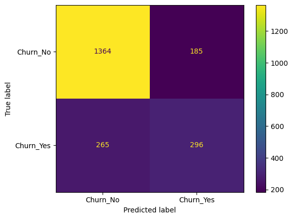

# Objetivo

O objetivo desta etapa do projeto foi dar continuidade à análise de churn da operadora fictícia Telecom X, agora focando na preparação e transformação dos dados para implementar modelos preditivos de machine learning.

Partimos de um dataset previamente limpo (df_limpo.csv), realizando ajustes finais e criando variáveis para modelagem.

Os 2 modelos preditivos usados foram **Regressão logística** e **Árvore de decisão**.

# Ferramentas Utilizadas

Pandas — Manipulação e tratamento de dados.

NumPy — Operações matemáticas e manipulação de arrays.

Seaborn — Criação de gráficos exploratórios.

Matplotlib — Visualização de dados.

Statsmodels — Análises estatísticas, cálculo de VIF (Variance Inflation Factor) para detecção de multicolinearidade.

# Etapas realizadas:

**1. Carregamento dos dados:**
Leitura do arquivo df_limpo.csv, que contém os dados já tratados na primeira parte do projeto [Telecom X - Parte 1](https://github.com/samantha-sf/desafio_Telecom_X).

**2. Remoção de Colunas Irrelevantes:**
A coluna customerID foi excluída, pois não contribui para a modelagem.

**3. Padronização de Valores Categóricos:**
Colunas relacionadas a serviços de internet (OnlineSecurity, OnlineBackup, etc.) tiveram o valor "No internet service" substituído por "No", simplificando as categorias.

**4. Codificação de Variáveis Categóricas:**
As variáveis categóricas foram transformadas em variáveis dummy (0/1) utilizando one-hot encoding, com drop_first=True para evitar multicolinearidade.

**5. Verificação de Dados Ausentes:**
Foi conferido se havia valores nulos após a codificação.

**6. Correlação entre as variáveis:**
Usando a biblioteca Seaborn, criamos um heatmap para analisar a correlação entre features e a variavel alvo ('Churn_Yes'), usando um limiar de correlação de 0.2.

**7. Análise de multicolinearidade:**
Primeiramente determinamos o VIF e visualizamos as variáveis mais correlacionadas. Depois refinamos o conjunto de variáveis para reduzir a multicolinearidade e retiramos as colunas redundantes, recalculando o VIF.

**8. Modelos preditivos:**
Primeiramente dividimos o dataset em treino e teste (test_size=0.3) e após definimos um modelo base com DummyClassifier (score 0.73).

**8.1 Regressão logística:**

Modelo previu 1.129 Churn_No e 454 Churn_Yes, tendo um melhor desempenho em acertar os clientes que desistiriam, comparado com a árvore de decisão.

**8.2 Árvore de decisão:**

Modelo previu 1.364 Churn_No e 296 Churn_Yes, tendo um melhor desempenho em acertar quais clientes não desistiriam, comparado com a regressão logística.

**9. Interpretações e conclusões:**
Regressão logística: Modelo previu 1.129 Churn_No e 454 Churn_Yes, tendo um melhor desempenho em acertar os clientes que desistiriam, comparado com a árvore de decisão.

Árvore de decisão: Modelo previu 1.364 Churn_No e 296 Churn_Yes, tendo um melhor desempenho em acertar quais clientes não desistiriam, comparado com a regressão logística.

Ou seja, a árvore de decisão teve um desempenho superior em prever quais clientes não desistiriam. Porém, o modelo de regressão logística se saiu melhor ao prever quais clientes desistiriam, em comparação com o modelo de árvore de regressão.

# Hard Skills desenvolvidas
Manipulação de dados com Pandas

Limpeza e padronização de valores

Codificação de variáveis categóricas (One-Hot Encoding)

Verificação de valores ausentes

Análise de multicolinearidade (VIF)

Leitura e exportação de datasets

